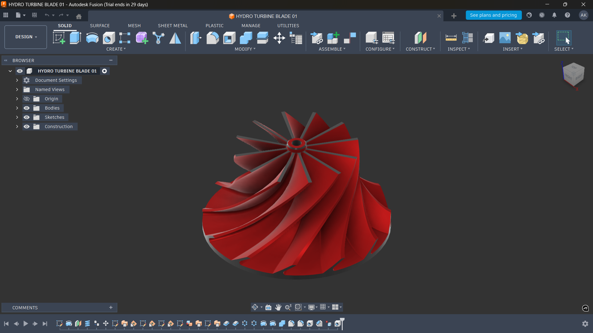
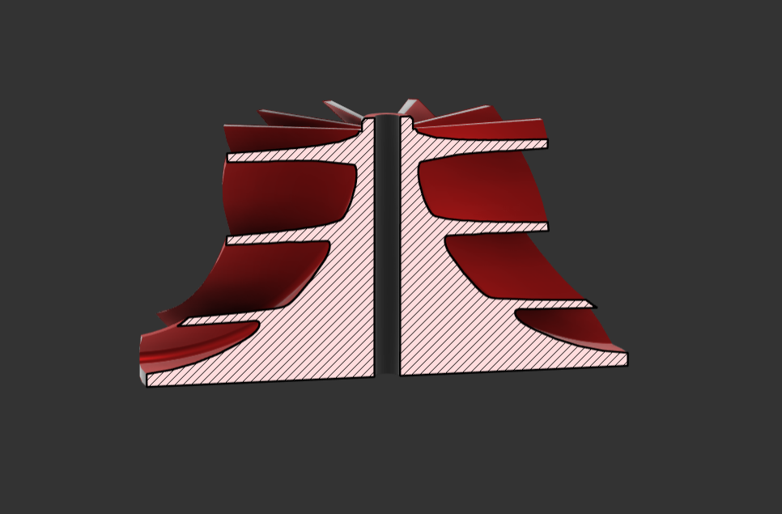

# Hydro Turbine Blade Design

CAD design of hydroelectric turbine blades developed in **Fusion 360**.

## Overview
This project focuses on modelling turbine blade geometry optimized for efficient water flow interaction in hydroelectric applications.

## Tools Used
- Fusion 360
- Surface modelling
- Parametric design

## Preview

## Files
- `blade_model.f3d` – Fusion 360 source file
